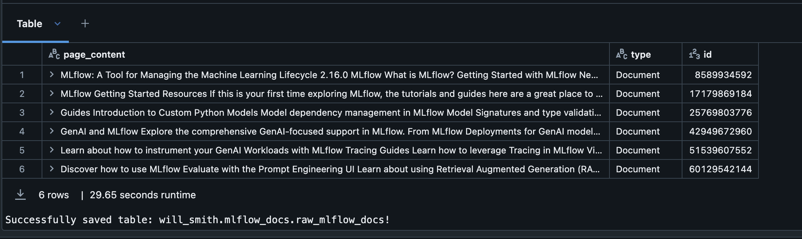
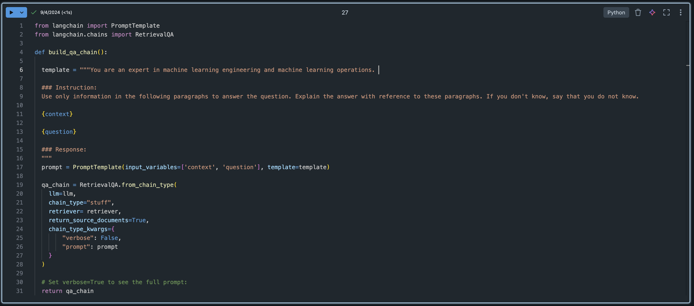
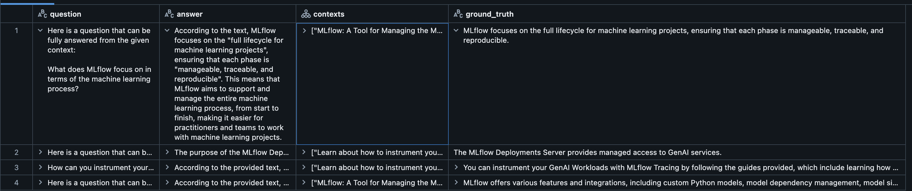
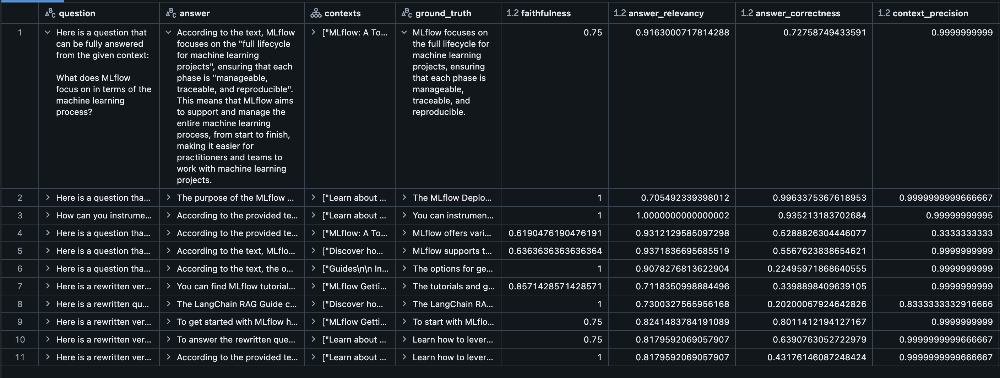

# Using Ragas for evaluating Retrieval Augmented Generation Chains on Databricks

Notes: 
- Validated with Databricks runtimes: 14.3 ML LTS and 13.3 ML LTS
- This is NOT official Databricks code and should be utilized as reference code. 

## Introduction

Ragas is a framework that helps you evaluate your Retrieval Augmented Generation (RAG) pipelines. RAG denotes a class of LLM applications that use external data to augment the LLM’s context. There are existing tools and frameworks that help you build these pipelines but evaluating it and quantifying your pipeline performance can be hard. This is where Ragas (RAG Assessment) comes in.

##### Key Features

- **Dataset Generation**: Ragas allows for the creation of diverse and comprehensive datasets that can be used to test the performance of RAG models.
- **Customizable**: Users can tailor the datasets to include specific types of queries and documents, ensuring that the testing scenarios are relevant to their use cases.
- **Integration with Databricks**: Ragas can be seamlessly integrated with Databricks, enabling users to leverage the powerful data processing and machine learning capabilities of the platform.

##### Benefits

- **Improved Model Performance**: By using well-constructed testing datasets, users can identify weaknesses in their RAG models and make necessary adjustments to improve performance.
- **Efficiency**: Automating the dataset generation process saves time and resources, allowing data scientists to focus on model development and optimization.
- **Scalability**: Ragas can handle large volumes of data, making it suitable for enterprise-level applications.

-----------

### Requirements

##### Tested with:
- 14.3.x-cpu-ml-scala2.12
- Databricks Runtime: 14.3 LTS ML 
    - (includes Apache Spark 3.5.0, Scala 2.12)
- Driver: i3.4xlarge 
- Workers: i3.xlarge [1 - 8]  
- Enable Autoscaling   

##### Python Packages:

`%pip install langchain langchain_community ragas databricks-vectorsearch llama_index`

- Versions if needed:
```python
langchain==0.2.16
langchain-community==0.2.16
ragas==0.1.18
databricks-vectorsearch==0.40
llama_index==0.11.9
```
-----------

### Notebooks

##### Create-testset
- Create a testset using Ragas and Databricks Foundation Model APIs
    - Models:
      - databricks-meta-llama-3-1-70b-instruct
      - databricks-gte-large-en
```python
generator = TestsetGenerator.from_langchain(
    generator_llm,
    critic_llm,
    embeddings
)
```
-----------
##### Evaluate Existing
- Evaluate a testset using Ragas and Databricks Foundation Model APIs
    - Models:
      - databricks-meta-llama-3-1-70b-instruct
      - databricks-gte-large-en
    - Dataset: 
      - explodinggradients/amnesty_qa", "english_v2
```python
from ragas import evaluate

result = evaluate(
    amnesty_qa["eval"],
    metrics=[
        context_precision,
        faithfulness,
        answer_relevancy,
        context_recall,
    ],
    llm = evaluation_llm, 
    embeddings = embeddings, 
    run_config = run_config
)

```
-----------
##### Mlflow Docs Evaluate Existing
- Create and evaluate a custom testset using Ragas 
- Construct a RAG chain with Databricks Foundation Model APIs + Langchain
    - Models:
      - databricks-meta-llama-3-1-70b-instruct
      - databricks-gte-large-en
    - Dataset: 
      - mlflow documentation 

-----------
### Examples:

##### Input Data:



-----------
##### Test Dataset:


-----------
##### Build QA Chain:



-----------
##### Evaluation Dataset: 






-----------